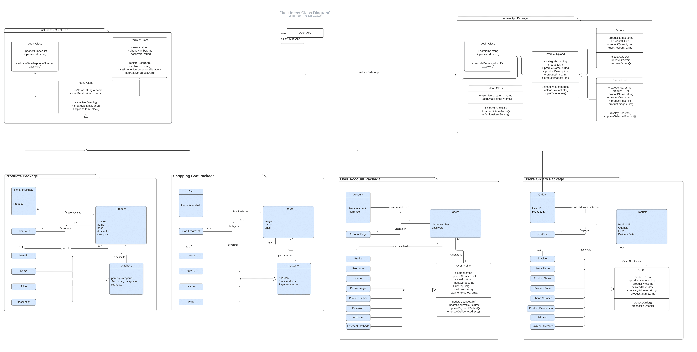
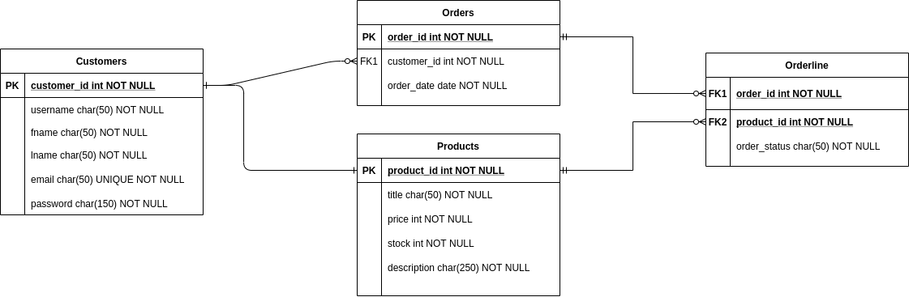

# Fundamental_Project

---
This project aims designed to demonstrate my skills and knowledge in incorporating "CRUD" (Create, Read, Update, Delete).
The project will use different project management and development methodologies to implement CRUD into the web application.

## Contents

---

* [**Brief**](#Brief)
* [Constraints](#Constraints)
* [Structure](#Structure)
* [Project Aims](#Project-Aims)

* [**User Stories**](#User-Stories)
* [User Register Story](#User-Register-Story)
* [User Login Story](#User-Login-Story)
* [**Risk Assessment**](#Risk-Assessment)

* [**UML Diagram - Structure**](#UML-Diagram)

## Brief

This project is an e-commerce application, where users will be able to both sell and purchase different types of products. This project will cover the following aspects of project management and development.

* Project Management
* Databases
* Java SE
* Spring Boot
* Front-End Development
* Automated Testing
* Continuous Integration
* Cloud Fundamentals

### Constraints

Below are the requirements that the web-app must adhere to.

* Kanban Board: Jira
* Database: GCP Managed SQL Server
* Programming language: Java (unless stated otherwise)
* Front-end: HTML, CSS and JavaScript
* Unit Tests: JUnit and Mockito
* Integration Tests: Selenium
* Version Control: Git
* CI Server: CircleCI
* Cloud server: GCP virtual machine

### Structure

The application implements the following structure:

* Index - Homepage (Holds and displays products)
  * User Account
        *Register / Login - satisfies "Create"
            *   Full name first/last
            *Username - Max of 16 characters and number
            *   Email
            *   Password

        *   View account Details (satisfies "Upgrade")
            *   Full name
            *   Username
            *   Email
            *   Password
            *   Address
            *   Previous Orders
            *   Help & FAQ's 
             
        *   Logout
        
        *   Remove Account (satisfies "Delete")

    * Create new Listing (satisfies "Create") - (must be a user)
      * Product Name
        * Product Image
        * Product Price
        * Category

    * View Already listed products (satisfies "Read")

    * Click Product
      * Product displays
      * Add to basket
        * Configure listing (if owned by user) - (satisfies "Edit/Update")
        * Remove Listing (if owned by user) - (satisfies "Delete")

### Project Aims

1. Provide a platform to sell client’s products in the fashion industry, similar to ASOS
2. Allow customers to upload their own products and be able to purchase from other customers.
3. Provide a secure way for payments to be made for customer protection and satisfaction.
4. Design a Platform that expresses simplicity and individuality.
5. Develop a web application that adheres strictly with the [Data Protection Act 1998](https://www.gov.uk/data-protection).

## User Stories

### User Register Story

Upon entering the website, products will be visible to anyone who enters.
However, to purchase or sell a product a user must create or have already created an account.
When creating an account a user must navigate to the “Account” section  and locate the Register/Login button.
When found the user can chose between those options, when registering the user must enter the following requirements;

* Full name

* Username

* Password

* Email

Once completed registration, the user will be allowed to purchase and sell products on the site.

### User Login Story

When a customer returns to the site, they are able to access the same features i.e. Add new products,
update account features and purchase products, by logging into their account.
The user must enter their correct details;

* Username/Email
* Password

Once they have entered their details they will be redirected to the home page where the user can now access the features above.

## Risk Assessment

---
|Risk                                                                                                | Probability  | Impact  | Severity                                                                                                                                                                    | Contingency Plan                                                                                                                                                                                         |
|---------------------------------------------------------------------------------------------------- |------------- |-------- |---------------------------------------------------------------------------------------------------------------------------------------------------------------------------- |--------------------------------------------------------------------------------------------------------------------------------------------------------------------------------------------------------- |
| Poor Authentication and authorization                                                              | Medium      | high   | High risk of data being stolen or misused, could potentially lead to identity theft or unauthorised purchases.                                                             | Provide a secure login system, as well as verifying purchases through secure payment methods such as PayPal or visa payment.                                                                            |
| Insecure Data Storage                                                                              | high        | high   | Incorrect storage of data such as Username, Password, Cookies, UDID/IMEI Device and Network name can have a negative impact on the security of an individual.              | Store data securely through encryption or using a secure database, Use SSL Certificates to validate data transfer from web app to database.Possible use of certificate pinning preventing MiTM attacks. |
| Design could become unorganized when displayed in larger mobile devices or when device is rotated. | High        | low    | This can impact the intended design and may lead to the app become unusable when rotate or used in a different device.                                                     | Create an adaptable application that can be viewed and used in different devices.                                                                                                                       |
| Language barrier could create problems when others try to                                          | high        | high   | Could impact sales of products and create problems when using the application.                                                                                             | Allow for language selection using the most known languages such as English Spanish and French                                                                                                          |
| Database crashes                                                                                   | Low         | High   | Database crashing could impact customers signing in and visiting the site, impacting sales and customer satisfaction                                                       | GCP offers 24/7 support as well as many Availability Zones within a region for when one server goes down the project will be able to run on a different AZ within the same region.                      |
| Product Purchases are unauthorised or accidental.                                                 | Medium      | High  | Purchases can be made without the users consent if someone has gained unauthorised access to the app or the users account.                                                 | Payment verification should be set up correctly so that a user can chose whether authorization be required before purchasing products or not.                                                           |
| Client Server communication can be intercepted                                                     | High         | High    | If for any reason communications between client and server is intercepted, information about the customer could me stolen with malicious intent and can hard the customer.  | We can protect from this by making sure to use a secure and encrypted server gates and encrypt the information with individually generated keys using server side code.                                  |

## UML Diagram

---

## ERD Diagram

---

Here we attempt to design a framework for the database by using an ERD or Entity Relationship Diagram.

# Project Structure

---

## Languages

*   JAVA:
    *   Build secure, robust and scalable web applications
        
    *   Its both the programming language used to build responsive web-apps, and the core structure in which they are built on.
       
    *   Used to format JSON queries to be presented on the website.
