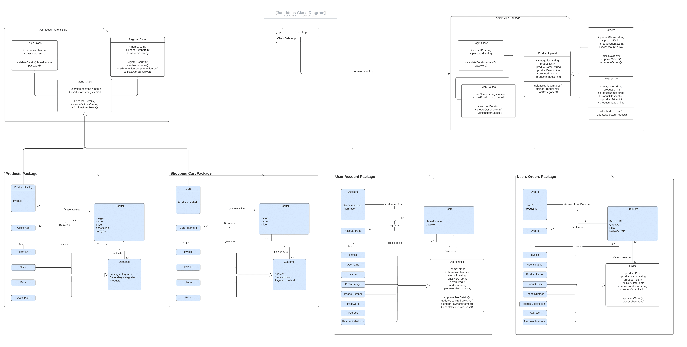
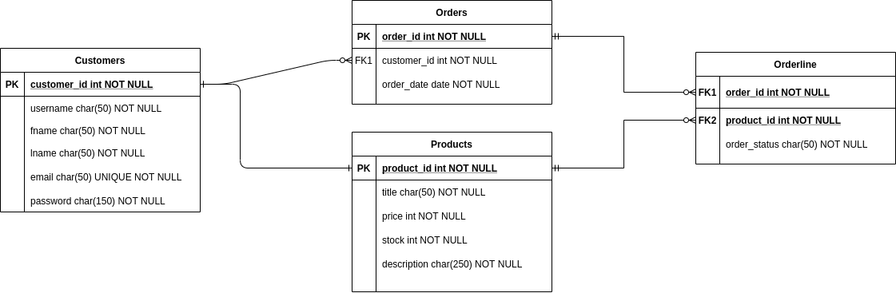
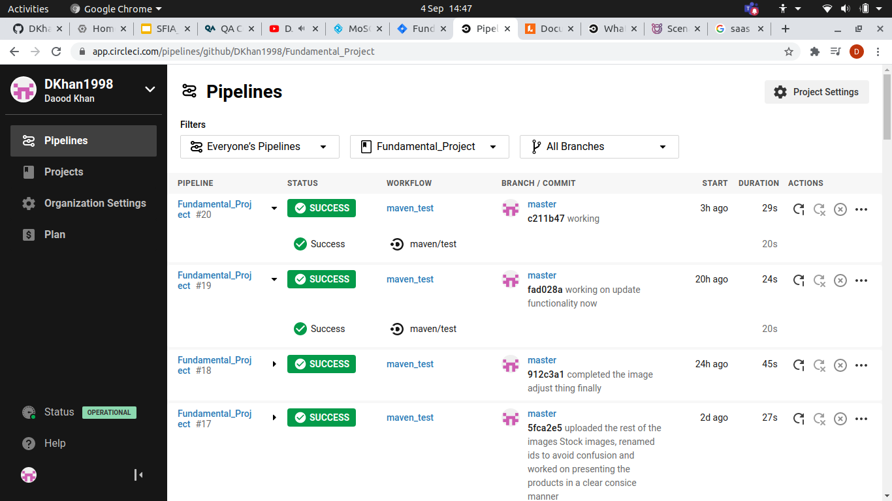
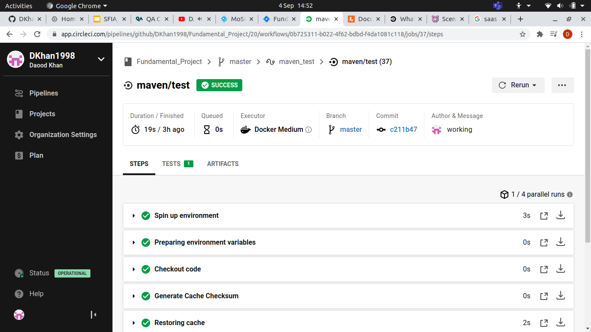
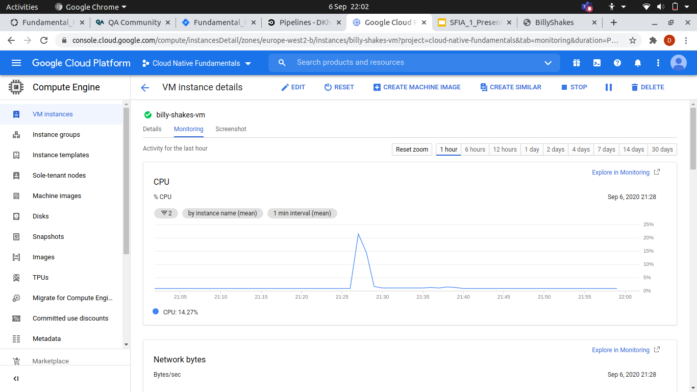

# Fundamental_Project

---
This project aims designed to demonstrate my skills and knowledge in incorporating "CRUD" (Create, Read, Update, Delete).
The project will use different project management and development methodologies to implement CRUD into the web application.

## Brief

This project is an e-commerce application, where users will be able to both sell and purchase different types of products. This project will cover the following aspects of project management and development.

* Project Management
* Databases
* Java SE
* Spring Boot
* Front-End Development
* Automated Testing
* Continuous Integration
* Cloud Fundamentals

### Constraints

Below are the requirements that the web-app must adhere to.

* Kanban Board: Jira
* Database: GCP Managed SQL Server
* Programming language: Java (unless stated otherwise)
* Front-end: HTML, CSS and JavaScript
* Unit Tests: JUnit and Mockito
* Integration Tests: Selenium
* Version Control: Git
* CI Server: CircleCI
* Cloud server: GCP virtual machine

### Client Specifications

*   Online Selling platform
*   Black & White & Pink
*   Professional but playful
*   User Register / Login
*   Post / Edit / Delete products

### Structure

The application implements the following structure:

*   Navigation Bar

    *   + Add Item, Account, Orders, Logout
*   A table 6 columns wide
    *   On column 1 row 1 add tablet for creating a new listing.
    *   Next tablets represent a product
        *   Product Image
        *   Product Name
        *   Product Price
    *   Contact Information:
        *   contact form
        *   contact links

### Project Aims

1. Provide a platform to sell client’s products in the fashion industry, similar to ASOS
2. Allow customers to upload their own products and be able to purchase from other customers.
3. Provide a secure way for payments to be made for customer protection and satisfaction.
4. Design a Platform that expresses simplicity and individuality.
5. Develop a web application that adheres strictly with the [Data Protection Act 1998](https://www.gov.uk/data-protection).

## User Stories

### User Register Story - Planning 

Upon entering the website, products will be visible to anyone who enters.
However, to purchase or sell a product a user must create or have already created an account.
When creating an account a user must navigate to the “Account” section  and locate the Register/Login button.
When found the user can chose between those options, when registering the user must enter the following requirements;

* Full name

* Username

* Password

* Email

Once completed registration, the user will be allowed to purchase and sell products on the site.

### User Login Story - MVP

Upon entering the website, products will be visible to anyone who enters. 
The user will be allowed to purchase products by clicking on the Order button.
An order will then be created for the user, which they can edit or remove later on.  
A user will also have the power to Add New Listing to the product database, 
through the use of a button within the navigation bar. 
This will take them to a different page, 
where they may add the details of the product an image from a selection off them and then submit the product.

Once that's completed the user can then manipulate and view this product at the home page where this will be displayed.

## Risk Assessment

---
|Risk                                                                                                | Probability  | Impact  | Severity                                                                                                                                                                    | Contingency Plan                                                                                                                                                                                         |
|---------------------------------------------------------------------------------------------------- |------------- |-------- |---------------------------------------------------------------------------------------------------------------------------------------------------------------------------- |--------------------------------------------------------------------------------------------------------------------------------------------------------------------------------------------------------- |
| Poor Authentication and authorization                                                              | Medium      | high   | High risk of data being stolen or misused, could potentially lead to identity theft or unauthorised purchases.                                                             | Provide a secure login system, as well as verifying purchases through secure payment methods such as PayPal or visa payment.                                                                            |
| Insecure Data Storage                                                                              | high        | high   | Incorrect storage of data such as Username, Password, Cookies, UDID/IMEI Device and Network name can have a negative impact on the security of an individual.              | Store data securely through encryption or using a secure database, Use SSL Certificates to validate data transfer from web app to database.Possible use of certificate pinning preventing MiTM attacks. |
| Design could become unorganized when displayed in larger mobile devices or when device is rotated. | High        | low    | This can impact the intended design and may lead to the app become unusable when rotate or used in a different device.                                                     | Create an adaptable application that can be viewed and used in different devices.                                                                                                                       |
| Language barrier could create problems when others try to                                          | high        | high   | Could impact sales of products and create problems when using the application.                                                                                             | Allow for language selection using the most known languages such as English Spanish and French                                                                                                          |
| Database crashes                                                                                   | Low         | High   | Database crashing could impact customers signing in and visiting the site, impacting sales and customer satisfaction                                                       | GCP offers 24/7 support as well as many Availability Zones within a region for when one server goes down the project will be able to run on a different AZ within the same region.                      |
| Product Purchases are unauthorised or accidental.                                                 | Medium      | High  | Purchases can be made without the users consent if someone has gained unauthorised access to the app or the users account.                                                 | Payment verification should be set up correctly so that a user can chose whether authorization be required before purchasing products or not.                                                           |
| Client Server communication can be intercepted                                                     | High         | High    | If for any reason communications between client and server is intercepted, information about the customer could me stolen with malicious intent and can hard the customer.  | We can protect from this by making sure to use a secure and encrypted server gates and encrypt the information with individually generated keys using server side code.                                  |

## UML Diagram

---

## ERD Diagram

---

Here we attempt to design a framework for the database by using an ERD or Entity Relationship Diagram.

# Project Structure

---

## Languages

*   JAVA:
    *   Build secure, robust and scalable web applications
    *   Its both the programming language used to build responsive web-apps, and the core structure in which they are built on.
    *   Used to format JSON queries to be presented on the website.

*   HTML5, CSS3, BOOTSTRAP :
    *   Creates responsive web-applications
    *   Used to create, display and manipulate stored data
    *   Can run instantaneously on most web browsers (in most cases)
    *   Offers a range of packages and tools to implement functionality on a webpage.

*   JSON / SQL :
    *   JSON is supported by most languages
    *   SQL & JSON can be used together
    *   SQL communicates with the server through request / response
    *   JSON formats the request / response

## Technologies

---

*   Google Cloud Platform
    *   Resources are instant, reliable and available.
    *   Complete control over resources, usage and flexibility
    *   Design and deploy nearly any website-serving system you want / need.

*   Circle CI :
    *   Offers fast, reliable and automated build & deploy functionality
    *   Simple progress structure
    *   Can be optimized for speed 
    *   Can be task specific, i.e. testing, building, acquiring prerequisites and packages
    *   Allows for performance specific pricing, simplifying running costs.

*   Codacy : 
    *   Catches code that does not adhere to recent coding standards
    *   Provides a comprehensive design, understand your code, errors and improvements.
    *   Clear visualization of work and improvement.

*   GitHub - Git :
    *   Allows for remote work with teams and individuals
    *   Provides a simple way to safely store and retrieve the project.
    *   Can be easily distributed and allow for collaboration
    *   Simple backup, rerolled, commit, push and fetch functionality

*   Postman : 
    *   A great tool when trying to dissect RESTful APIs
    *   Simplifies generating html request, rather than writing code.
    *   It’s simple to use and navigate
    *   Automated tests can be easily set up using the Postman API testing tool

## Web-Structure

---

*   Index  (satisfies “READ")
*   Create new Listing (satisfies “CREATE") 
    *   Product Name
    *   Product Image
    *   Product Price
    *   Product Stock
*   Delete product (satisfies “DELETE”)
*   Configure listing (satisfies “UPDATE")

## CIRCLE CI

---

;
;

## GCP VM Instance

---

